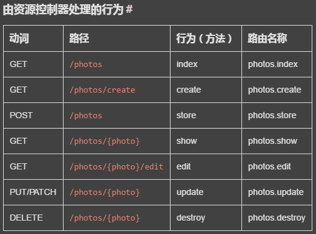

## Laravel基础

[TOC]


### 开发环境

Windows 上可以使用 wamp、wnmp 或 [xammp]

Homestead Mac 上的集成开发环境

​	Vagrant box 是一个虚拟机管理软件，Homestead 运行在 Vagrant 之上。Homestead 也可以在 Mac 以外的其他系统上运行，里面包含了 Nginx、PHP 7.0、MySQL、Postgres、Redis、Memcached、Node 以及其他需要用到的各种软件。

需要尝试安装 Homestead 时，在参阅官方文档学习安装步骤。

Valet Mac 专用极简主义开发环境

同样对 Valet ，需要时查阅手册


系统要求：

- PHP >= 5.6.4
- OpenSSL PHP Extension
- PDO PHP Extension
- Mbstring PHP Extension
- Tokenizer PHP Extension
- XML PHP Extension

#### Laravel 文件目录结构

- /app/ 包含程序核心代码，你写的代码基本就放在这里面

  - Console/ 控制台交互入口，包含全部 Artisan 命令，该命令可以生成 app 下的很多类

    `php artisan list make` 

  - Events/ 事件类，event:generate/event:make

  - Exceptions/ 处理异常

  - Http/ 包含控制器、中间件和请求，是网络 API 的入口，处理请求

  - Jobs/ 队列任务，make:job

  - Listeners/ 事件监听器，event:generate/make:listener

  - Mail/ 邮件发送类，make:mail

  - Notifications/ 通知，make:notification

  - Policies/ 授权策略，make:policy

  - Providers/ 服务提供者，绑定服务到容器及注册事件等，为请求处理做准备

- /bootstrap/ 包含几个框架启动和自动加载设置文件

  - cache/ 启动性能优化时生成的文件

- /config/ 框架配置文件

- /database/ 数据库迁移与数据填充文件

- /public/ 可以包含前端控制器和资源（图片、JS、CSS 等）文件

  - index.php 程序的入口

- /resources/ 视图、原始资源（LESS、SASS、CoffeeScript）文件，以及语言包

- /routes/ 默认路由定义（好像没有）

  - web.php
  - api.php
  - console.php 基于命令行的应用入口

- /storage/ 包含编译后的 Blade 模板、session、文件缓存和其他生成文件。

  - app/ 应用程序使用的文件
    - public/ 作为公开磁盘存放上传文件
  - framework/ 保存框架生成文件及缓存
  - logs/ 日志文件

- /tests/ 自动化测试，包含 PHPUnit 例子

- /vendor/ Composer 依赖模块

- /.env.example 环境配置文件模板

- /.env 环境配置文件，里面有程序秘钥和数据库等与运行环境有关的配置信息，秘钥保证 Session 和加密数据的安全。该文件不应提交到版本控制系统。

  - 环境变量被加载到 $_ENV 超级全局变量中，通过以下函数获得：

  ```php
  'debug' => env('APP_DEBUG', false);

  $environment = App::environment();  // 获取APP_ENV
  if (App::environment('local', 'staging')) {
      // 当前环境处于 `local` 或者 `staging`
  }
  ```

/storage/  /bootstrap/cache/ 临时存储目录，服务器需要有写入权限。

#### 配置

Laravel 框架的配置文件都放在 /config/ 目录下。如下获取配置属性：

```php
$value = config('app.timezone');
config(['app.timezone' => 'America/Chicago']); // 修改
```

- 缓存配置
  - `php artisan config:catch` 将配置文件合成到缓存文件中，加快框架的加载，用于部署工作中。
- 维护模式——返回 503
  - `php artisan down` 
  - `php artisan down --message='Upgrading Database' --retry=60` 
  - `php artisan up` 关闭维护模式
  - `resources/views/errors/503.blade.php` 维护模式模板文件

#### 错误与日志

* config/app.php 中有关日志的配置

  * 'debug' => env('APP_DEBUG', false) 开发中设为 true ，生产环境设为 false 
  * 'log' => env('APP_LOG', 'single') 设置日志模式，daily 默认保存 5 天，可以用 'log_max_files' => 30 来修改
  * 'log_level' => env('APP_LOG_LEVEL', 'error') 设置记录日志级别，debug-info-notice-warning-error-critical-alert-emergency
  * 日志使用 Monolog 进行设置

  ```php
  // bootstrap/app.php
  $app->configureMonologUsing(function($monolog) {
      $monolog->pushHandler(...);
  });

  return $app;
  ```

* 异常处理

  * App\Exceptions\Handler 类用来处理异常

  * $dontReport 数组记录不需要报告的异常类型

  * 包含两个方法

    * report 用来将异常发送到不同的处理服务

    ```php
    /**
     * 报告或记录异常。
     *
     * 这是一个很棒的位置将异常发送到 Sentry ，Bugsnag ，etc 
     *
     * @param  \Exception  $exception
     * @return void
     */
    public function report(Exception $exception)
    {
        if ($exception instanceof CustomException) {
            //
        }

        return parent::report($exception);
    }
    ```

    * render 将异常转换为 HTTP 响应发送给浏览器

    ```php
    /**
     * 渲染异常并添加到响应中。
     *
     * @param  \Illuminate\Http\Request  $request
     * @param  \Exception  $exception
     * @return \Illuminate\Http\Response
     */
    public function render($request, Exception $exception)
    {
        if ($exception instanceof CustomException) {
            return response()->view('errors.custom', [], 500);
        }
    	// 默认交给生成响应的父类处理
        return parent::render($request, $exception);
    }
    ```

* HTTP 异常

  * 产生异常

    ```php
    abort(404);
    abort(403, 'Unauthorized action.');
    ```

  * 自定义错误页面

    `resources/views/errors/状态码.blade.php` 

    HttpException 会将 abort 函数传递到该视图作为 $exception 变量

* Monolog 日志

  * 日志被记录在 storage/logs/ 目录下
  * 通过 Log facade 写入日志信息
  * 有 Log::info($message) 等八种日志级别
  * 可以传递一个数组上下文

  ```php
  Log::error('User failed to login.', ['id' => $user->id]);
  ```

  * 访问底层的 Monolog 示例：

  ```php
  $monolog = Log::getMonolog();
  ```


### 核心概念

#### 服务容器

一个管理类依赖和运行依赖注入的强大工具，几乎所有服务容器的绑定都是在服务提供者中进行的。

绑定就是告诉服务容器，当声明一个类名的时候，该如何创建一个该类的实例。一下绑定都是在一个类的 register 中给出，就是告诉 Laravel 当需要一个类的实例时该如何去创建。

- 简单绑定：`$this->app->bind(注册类或接口的名称'APIName', 返回该实例对象的函数闭包Closure($app){...};` 将容器本身，应该就是指 $app ，传入闭包，这样可以创建子依赖。

  ```php
  $this->app->bind('HelpSpot\API', function ($app) {
      return new HelpSpot\API($app->make('HttpClient'));
  });
  ```

- 绑定单例： `$this->app->singleton(...)` 

  ```php
  $this->app->singleton('HelpSpot\API', function ($app) {
      return new HelpSpot\API($app->make('HttpClient'));
  });
  ```

- 绑定实例：也是单例，不过是手动创建实例，然后绑定到容器。

  ```php
  $api = new HelpSpot\API(new HttpClient);

  $this->app->instance('HelpSpot\Api', $api);
  ```

- 绑定初始数据：这个方法确实太优雅了，用来给一个类注入原始数据。当需要这个类的对象时，需要这个变量，给出变量值。

  ```php
  $this->app->when('App\Http\Controllers\UserController')
            ->needs('$variableName')
            ->give($value);
  ```

绑定接口：

```php
$this->app->bind(
    'App\Contracts\EventPusher',
    'App\Services\RedisEventPusher'
);
```

就是当需要一个接口时，注入的是其绑定的具体实现类。

情境绑定：

下面就是情境绑定的语法格式。

```php
use Illuminate\Support\Facades\Storage;
use App\Http\Controllers\PhotoController;
use App\Http\Controllers\VideoController;
use Illuminate\Contracts\Filesystem\Filesystem;

$this->app->when(PhotoController::class)
          ->needs(Filesystem::class)
          ->give(function () {
              return Storage::disk('local');
          });

$this->app->when(VideoController::class)
          ->needs(Filesystem::class)
          ->give(function () {
              return Storage::disk('s3');
          });
```

通过这种方法可以定义两种不同的类的实现方式。

标记：

这是一种批量处理同一个接口的多个示例的方法。

```php
$this->app->bind('SpeedReport', function () {
    //
});

$this->app->bind('MemoryReport', function () {
    //
});

$this->app->tag(['SpeedReport', 'MemoryReport'], 'reports');
```

一旦服务被标记后，你可以通过 `tagged` 方法轻松地将它们全部解析：

```php
$this->app->bind('ReportAggregator', function ($app) {
    return new ReportAggregator($app->tagged('reports'));
});
```

解析：

就是创建一个实例对象

```php
$api = $this->app->make('HelpSpot\API');
// 或者
$api = resolve('HelpSpot\API');
```

这还是手动创建，另外也可以自动创建，在构造器中使用类型提示就可以完成自动注入，就是在参数变量前面声明类名，剩下创建实例的任务就交给 Laravel 的服务容器了。

每当服务容器解析一个对象时就会触发一个事件，可以使用 resolving 方法监听这个事件，用于监听实例的创建。

```php
$this->app->resolving(function ($object, $app) {
    // 解析任何类型的对象时都会调用该方法...
});

$this->app->resolving(HelpSpot\API::class, function ($api, $app) {
    // 解析「HelpSpot\API」类型的对象时调用...
});
```


#### 服务提供者

所有 Laravel 应用程序启动的中心，启动包括注册服务容器绑定、事件侦听器、中间件和路由，这一切底层的功能都由服务提供者完成。在 config/app.php 配置文件中有服务提供者数组 providers 。

编写自己的服务提供者，并将它注册到 Laravel 应用程序中。

所有的服务提供者都要继承 `Illuminate\Support\ServiceProvider` 类，里面包含 `register` 和 `boot` 方法。在 `register` 方法中**只将事物绑定至服务容器之中**。

可以通过 php artisan make:provider NewServiceProvider 来生成新的提供者文件。在任何一个服务提供者方法中，总可以通过访问 `$app` 属性来使用服务容器， `$this->app` 。

在 boot 方法中，可以注册一个视图 composer(一个服务) 。boot 方法是在所有服务提供者的 register 方法被调用之后才开始调用，因此它里面可以使用所有已经注册过的服务（类）。

```php
<?php

namespace App\Providers;

use Illuminate\Support\ServiceProvider;

class ComposerServiceProvider extends ServiceProvider
{
    /**
     * 启动任意应用服务。
     * @return void
     */
    public function boot()
    {
        view()->composer('view', function () {
            //
        });
    }
}
```

boot 方法可以通过依赖注入接收参数。

```php
use Illuminate\Contracts\Routing\ResponseFactory;

public function boot(ResponseFactory $response)
{
    $response->macro('caps', function ($value) {
        //
    });
}
```

服务提供者在 config/app.php 的 providers 数组中注册。

```php
'providers' => [
    // 其它的服务提供者
    App\Providers\ComposerServiceProvider::class,
],
```

延迟提供者：

不立即运行 register 中的注册逻辑，而是等到真正需要的时候才执行。Laravel 会保存一份清单，上面记录了需要延缓提供的服务名和服务提供者的类名，当需要这份清单上的类的时候，才会加载该服务提供者。需要延缓加载时，需要在服务提供者中设定 $defer 属性为 true ，并且定义一个 provides 方法，该方法返回提供者所注册的服务容器绑定。

```php
<?php namespace App\Providers;

use Riak\Connection;
use Illuminate\Support\ServiceProvider;

class RiakServiceProvider extends ServiceProvider
{
    /**
     * 指定提供者加载是否延缓。
     * @var bool
     */
    protected $defer = true;

    /**
     * 注册服务提供者。
     * @return void
     */
    public function register()
    {
        $this->app->singleton(Connection::class, function ($app) {
            return new Connection($app['config']['riak']);
        });
    }

    /**
     * 获取提供者所提供的服务。
     * @return array
     */
    public function provides()
    {
        return [Connection::class];
    }
}
```

##### 小结：

服务容器是注册/绑定服务的地方，就是将名称和创建实例的方式连接在一起，告诉 Laravel 该如何解析依赖。同时服务容器也会调用服务提供者来完成实例的创建。

ServiceProvider 就是一个给出如何创建实例的一个类。当需要创建一个类的实例时，会调用服务提供者的 register 方法，该方法再调用服务容器 $app 的方法来创建一个绑定。

应用程序运行时，会对配置文件中的 providers 数组中提供的服务提供者进行启动，首先运行 register 将服务注册到服务容器中，然后运行 boot 创建一些实例或应用所需要的对象。这样，当需要依赖注入的时候，服务容器就可以将服务实例注入到需要的地方了。

Laravel 中，不再需要显示提供 new 出来的对象，而是交给服务提供者告诉服务容器如何 new 出服务（有点绕）。


#### Facades

Facades 是服务容器中可用类的一个"静态"接口，类似于静态类，但功能优于传统的静态方法调用，可用直接通过 Facades::method() 来使用其中的服务（方法），命名空间为 `Illuminate\Support\Facades` 。

```php
use Illuminate\Support\Facades\Cache;

Route::get('/cache', function () {
    return Cache::get('key');
});
```

Facades 这样的服务类不用使用类名了，可以直接使用，所有的 Facades 都在 config/app.php 中注册了别名，放在 alias 数组中。

（Facades 有自身的方便测试和扩展的能力）

关于选择 Facades 还是依赖注入的考虑点涉及到测试，暂时还不太了解。

一些辅助函数可以替代 Facades 方法的功能，两者是等价的，辅助函数底层也是在调用 Facades 类来完成功能。

##### 工作原理：

Facade 利用 __callStatic() 这个魔术方法来延迟调用容器中的对象的方法。Facade 实际上是实现接口的一个实现的代理，调用的方法会被传递到底层的实例对象。

Facades 类都继承了 Facade 类，并存在一个 getFacadeAccessor() 方法，这个方法会返回服务容器中绑定的类名。当调用 Facades 的一个静态方法时，Laravel 会对该 Facades 进行解析，通过该 Facades 中的类名找到服务容器中绑定的那个实例对象，然后再调用这个实例对象的方法。

（Laravel 内置 30 个 Facades 类）


#### Contracts

 一组定义了框架核心服务的**接口**，这些接口就是框架的核心（就是因为使用的都是接口才被称为是框架）。

（这部分主要是用来开发扩展包的，大概，实际上与 Facades 很类似）

Contracts 的使用同样来自于依赖注入。


### HTTP 层

#### 路由

Laravel 示例中的路由使用的是 Route 这个 Facade ，通过调用底层的相应方法来实现对不同请求方式的处理。

```php
Route::get($uri, $callback);
Route::post($uri, $callback);
```

所有的路由都在 /routes/ 下定义，由框架自动加载。

响应多个方法的路由函数：

```php
Route::match(['get', 'post'], '/', function () {
    //
});
Route::any('foo', function () {
    //
});
```

定义路由参数：

```php
Route::get('posts/{post}/comments/{comment}', function ($postId, $commentId) {
    //
});
```

可选路由参数，变量必须有默认值：

```php
Route::get('user/{name?}', function ($name = null) {
    return $name;
});
Route::get('user/{name?}', function ($name = 'John') {
    return $name;
});
```

可以给路由命名，这样就可以通过名称来找到路由：

```php
Route::get('user/profile', 'UserController@showProfile')->name('profile');
```

命名路由可以方便地生成 URLs ：

```php
// Generating URLs...
$url = route('profile');
// Generating Redirects...
return redirect()->route('profile');
```

带参数的路由：

```php
Route::get('user/{id}/profile', function ($id) {
    //
})->name('profile');
$url = route('profile', ['id' => 1]);
```

路由组允许组中的所有路由共享一些属性，如中间件和名称空间。这些共享的属性可以一起放到一个数组中，作为路由组的第一个参数。

- 中间件

  ```php
  Route::group(['middleware' => 'auth'], function () {
    Route::get('/', function () {
      // Uses Auth Middleware
    });
    ...   
  });
  ```

- 名称空间

  ```php
  Route::group(['namespace' => 'Admin'], function () {
    // Controllers Within The "App\Http\Controllers\Admin" Namespace 
  });
  ```

- 路由前缀

  ```php
  Route::group(['prefix' => 'admin', function () {
    Route::get('users', function () {
      //  Matches The "/admin/users" URL
    });  
  });
  ```

- 子域名路由

  ```php
  Route::group(['domain' => '{account}.myapp.com', function () {
    Route::get('user/{id}', function ($account, $id) {
      //
    })
  });
  ```

注意：路由中组件默认可以省略掉前面的 App\Http\Controllers 名称空间。

路由模型绑定：传入的是 User 的 ID，但 Laravel 会自动通过这个 ID 生成一个 User 实例，并注入到参数中。默认绑定 ID ，可以重写 Eloquent 模型的 getRouteKeyName 方法来自定义绑定的字段名称。

- 隐式绑定

  ```php
  Route::get('api/users/{user}', function (App\User $user) {
      return $user->email;
  });
  ```

- 显式绑定

  在 RouteServiceProvider 中显式绑定。

  ```php
  public function boot()
  {
      parent::boot();
      Route::model('user', 'App\User');
  }

  $router->get('profile/{user}', function(App\User $user) {
      //
  });
  ```

如果数据库中不存在 ID ，就返回 404 错误。

表单方法伪造：

因为 HTML 表单只能提交 GET 和 POST ，所以要提交其他请求方法时，需要在表单中添加一个隐藏字段。

```html
<input type="hidden" name="_method" value="PUT">
<!-- 或者用 {{ method_field('PUT')}} -->
```

获取当前路由信息：（具体内容可参考 Route facade 的 API）

```php
$route = Route::current();
$name = Route::currentRouteName();
$action = Route::currentRouteAction();
```

自定义解析逻辑：

```php
$router->bind('user', function ($value) {
    return App\User::where('name', $value)->first();
});
```

当 URL 传入 user 参数时，该参数会作为 $value 传给该闭包，然后返回一个需要的结果。

#### 中间件

中间件就是请求的过滤器，所有请求都会首先经过中间件的处理。中间件放在 app/Http/Middleware/ 目录下。

-    创建： php artisan make:middleware CheckAge

     ```php
     <?php namespace App\Http\Middleware;

     use Closure;

     class CheckAge
     {
         /**
     * 运行请求过滤器。
     * @param  \Illuminate\Http\Request  $request
     * @param  \Closure  $next
     * @return mixed
     */
     ```
      public function handle($request, Closure $next, $middlewareParam)
      {
          if ($request->age <= 200) {
              return redirect('home');
          }
          $response = $next($request);
          return $response;
      }
     }

  Route::put('post/{id}', function ($id) {
      //
  })->middleware('middleware:middlewareParam');
  ```

- 注册：

  - 全局中间件： 在 /app/Http/Kernel.php 中的 $middleware 属性中注册。

  - 为特定路由指派中间件：先在 /app/Http/Kernel.php 中的 $routeMiddleware 属性中给中间件类指定名称，然后

    ```php
    Route::get('/', function () {
        //
    })->middleware('first', 'second');
    // 也可以不注册直接指定
    use App\Http\Middleware\CheckAge;

    Route::get('admin/profile', function () {
        //
    })->middleware(CheckAge::class);
  ```

-   中间件组：同样在 /app/Http/Kernel.php 中， $middlewareGroups 属性。

    ```php
    protected $middlewareGroups = [
        'web' => [
            \App\Http\Middleware\EncryptCookies::class,
            \Illuminate\Cookie\Middleware\AddQueuedCookiesToResponse::class,
            \Illuminate\Session\Middleware\StartSession::class,
            \Illuminate\View\Middleware\ShareErrorsFromSession::class,
            \App\Http\Middleware\VerifyCsrfToken::class,
            \Illuminate\Routing\Middleware\SubstituteBindings::class,
        ],

        'api' => [
            'throttle:60,1',
            'auth:api',
        ],
    ];
    ```

使用：

```php
Route::get('/', function () {
    //
})->middleware('web');
Route::group(['middleware' => ['web']], function () {
    //
});
```

默认情况下，`RouteServiceProvider` 已经为 `routes.php` 文件指定了 `web` 中间件组。

Terminable 中间件：在用户接受到请求后执行的内容，需要注册为 Kernel.php 中的全局中间件。

```php
class StartSession
{
    public function handle($request, Closure $next)
    {
        return $next($request);
    }

    public function terminate($request, $response)
    {
        // 保存 session 数据...
    }
}
```

#### CSRF 保护

只要在表单中添加一个隐藏字段， Laravel 就会通过中间件 VerifyCsrfToken 验证用户的身份 token 。

```html
<input type="hidden" name="_token" value="{{ csrf_token() }}">
<!-- 或 {{ csrf_field() }} -->
```

VerifyCsrfToken 中间件中可以用 protected $except = ['route/*']; 的形式来添加白名单。

除了 CSRF token 之外，还会检查请求头中是否有 X-CSRF-TOKEN 。

```html
<meta name="csrf-token" content="{{ csrf_token() }}">
```

```javascript
$.ajaxSetup({
    headers: {
        'X-CSRF-TOKEN': $('meta[name="csrf-token"]').attr('content')
    }
}); // 设置请求头信息
```

另外， Laravel 还会把 CSRF token 保存在 XSRF-TOKEN 的cookie 中，这样可以通过设置 X-XSRF-TOKEN 请求头来携带 CSRF token 。

#### 控制器

用来处理请求，一般存放在 /app/Http/Controllers/ 目录下。

控制器可以基础基础控制器 Controller 以获得一些已有的方法，另外还有自定义的一些处理方法，并在路由中指向该控制器的该方法，参数也会被一并传递过去。

```php
Route::get('user/{id}', 'UserController@show');
```

-    单一行为的控制器： __invoke($id)

-    中间件： __construct()

     ```php
        class UserController extends Controller
        {
            /**
     * 添加一个 UserController 实例。
     * @return void
     */
     ```
      public function __construct()
      {
          $this->middleware('auth');
          $this->middleware('log')->only('index');
          $this->middleware('subscribed')->except('store');
      }
     }
  ```

- RESTful 资源控制器：

  php artisan make:controller  PhotoController --resource

  ```php
  Route::resource('photos', 'PhotoController');
  ```

  

  部分资源路由：

```php
  Route::resource('photo', 'PhotoController', ['only' => [
      'index', 'show'
  ]]);

  Route::resource('photo', 'PhotoController', ['except' => [
      'create', 'store', 'update', 'destroy'
  ]]);
```

  命名资源路由：

```php
  Route::resource('photo', 'PhotoController', ['names' => [
      'create' => 'photo.build'
  ]]);
```

  重命名资源路由器参数：

```php
  Route::resource('user', 'AdminUserController', ['parameters' => [
      'user' => 'admin_user'
  ]]);
  //  uri: /user/{admin_user}
```

- 依赖注入

  控制器的构造器可以使用依赖注入来设置参数，方法中也可以使用类型提示来注入依赖。

- 路由缓存

  只会作用在控制器类上，可以先生成缓存，这样运行时就会快很多。

  php artisan route:cache

  相当于对 /app/Http/routes.php 进行预处理。

  php artisan route:clear  移除缓存

#### 请求

请求封装的类为 Illuminate\Http\Request ，可以使用类型提示来使用依赖注入。

一些常用方法：

```php
$uri = $request->path();
if ($request->is('admin/*')) {}
$url = $request->url(); // Without Query String...
$url = $request->fullUrl(); // With Query String...
$method = $request->method();
if ($request->isMethod('post')) {}

//获取输入数据
$inputs = $request->all(); //返回数组
$name = $request->input('name', 'Sally'); //获取用户输入的数据，可以带默认值
$name = $request->input('products.0.name');
$names = $request->input('products.*.name');  //参数是数组

$name = $request->name; //动态属性获取
$name = $request->input('user.name'); //获取 JSON 信息，需要 Content-Type:application/json

$inputs = $request->only(['username', 'password']);
$inputs = $request->only('username', 'password');
$inputs = $request->except(['credit_card']);
$inputs = $request->except('credit_card');
if ($request->has('name')) {} //存在且不为空

//闪存 request 传来的数据到 Session
$request->flash();
$request->flashOnly(['username', 'email']);
$request->flashExcept('password');

return redirect('form')->withInput();
return redirect('form')->withInput(
    $request->except('password')
);
$username = $request->old('username');
//<input type="text" name="username" value="{{ old('username') }}">

// Cookies
$value = $request->cookie('name');
return response('Hello World')->cookie(
    'name', 'value', $minutes, $path, $domain, $secure, $httpOnly
);
$cookie = cookie('name', 'value', $minutes);
return response('Hello World')->cookie($cookie);

// Files 文件上传
$file = $request->file('photo'); //获取 Symfony\Component\HttpFoundation\File\UploadedFile 类的实例，该类继承了 SplFileInfo 类
$file = $request->photo;
if ($request->hasFile('photo')) {}
if ($request->file('photo')->isValid()) {}
$path = $request->photo->path(); //文件完整路径
$extension = $request->photo->extension(); //猜测文件扩展名

$path = $request->photo->store('images'); //会自动命名
$path = $request->photo->store('images', 's3'); //第二个参数为磁盘名
$path = $request->photo->storeAs('images', 'filename.jpg');
$path = $request->photo->storeAs('images', 'filename.jpg', 's3');
```

PSR-7标准：

需要的库函数

```
composer require symfony/psr-http-message-bridge
composer require zendframework/zend-diactoros
```

请求 request 类型为 Psr\Http\Message\ServerRequestInterface

#### 响应

路由必须返回某个类型的响应发送回浏览器。

-    创建

     - 直接返回字符串&数组，也可以返回 Eloquent 集合，将被自动转换为 JSON 数据

     - 返回 Illuminate\Http\Response 实例，继承自 Symfony\Component\HttpFoundation\Response 类。

       一些构造响应的方法：

       ```php
       //headers
       return response('Hello World', 200)->header('Content-Type', 'text/plain');
       return response($content)->header('Content-Type', $type)->header('X-Header-One', 'Header Value');
       return response($content)->withHeaders([
                       'Content-Type' => $type,
                       'X-Header-One' => 'Header Value',
                       'X-Header-Two' => 'Header Value',
                   ]);
       //cookies 在 App\Http\Middleware\EncryptCookies 中间件的 $except 属性中可以设置不需要加密的 cookie
       return response($content)->header('Content-Type', $type)->cookie('name', 'value', $minutes);
       ```

-    重定向

        重定向也是一个实例对象，来自 Illuminate\Http\RedirectResponse 类，通过全局函数 redirect 就可以生成。

     ```php
        return redirect('home/dashboard');

        // 一些常用方法
        return back()->withInput(); //重定向至前一个位置
        return redirect()->route('login'); //重定向至路由
        return redirect()->route('profile', ['id' => 1]);
        // 通过下面的 URI 参数定向到路由: profile/{id} ID自动提取
        return redirect()->route('profile', [$user]);
        // 重定向到控制器
        return redirect()->action('HomeController@index');
        return redirect()->action('UserController@profile', ['id' => 1]);
        // 重定向并带有闪存 {{ session('status') }}
        return redirect('dashboard')->with('status', 'Profile updated!');
     ```

-    其他响应类型

     - 视图响应

       ```php
       return response()->view('hello', $data, 200)->header('Content-Type', $type);
       ```

     - JSON 响应

       ```php
       return response()->json([
           'name' => 'Abigail',
           'state' => 'CA'
       ]);

       // JSONP 响应
       return response()->json(['name' => 'Abigail', 'state' => 'CA'])->withCallback($request->input('callback'));
       ```

     - 文件下载

       ```php
       return response()->download($pathToFile);
       return response()->download($pathToFile, $name, $headers);
       ```

     - 文件响应（直接在浏览器中显示）

       ```php
       return response()->file($pathToFile);
       return response()->file($pathToFile, $headers);
       ```

-    响应宏

     ```php
        <?php namespace App\Providers;

        use Illuminate\Support\ServiceProvider;
        use Illuminate\Support\Facades\Response;

        class ResponseMacroServiceProvider extends ServiceProvider
        {
            /**
     * 注册应用的响应宏
     * @return void
     */
     ```
      public function boot()
      {
          Response::macro('caps', function ($value) {
              return Response::make(strtoupper($value));
          });
      }
     }

  //调用宏方法时，会运行闭包
  return response()->caps('foo');


#### Session


#### 表单验证


#### 视图


#### Blade 模板


#### 本地化


### 数据库

#### 入门

数据库配置文件放在 /config/database.php 文件中。

查询数据库有三种方式：

- 原生（Raw）的 SQL 语句

  DB::select(), DB::update(), DB::insert(), DB::delete(), DB::statement()

```php
  $users = DB::select('select * from users where active = ?', [1]);
  // 命名绑定
  $results = DB::select('select * from users where id = :id', ['id' => 1]);
  // 得到的结果是一个对象数组
  foreach ($users as $user) {
      echo $user->name;
  }

  DB::insert('insert into users (id, name) values (?, ?)', [1, 'Dayle']);

  // 监听 SQL 语句的执行
  <?php namespace App\Providers;

  use Illuminate\Support\Facades\DB;
  use Illuminate\Support\ServiceProvider;

  class AppServiceProvider extends ServiceProvider
  {
      /**
       * Bootstrap any application services.
       * @return void
       */
      public function boot()
      {
          DB::listen(function ($query) {
              // $query->sql
              // $query->bindings
              // $query->time
          });
      }

      /**
       * Register the service provider.
       * @return void
       */
      public function register()
      {
          //
      }
  }
```

  ##### 查询构造器

  见下一节

- Eloquent ORM

  见对应章节

##### 事务

- 自动处理

  ```php
  DB::transaction(function () {
      DB::table('users')->update(['votes' => 1]);
      DB::table('posts')->delete();
  });
  ```

- 手动操作

  ```php
  DB::beginTransaction();
  DB::rollBack();
  DB::commit();
  ```

#### 查询构造器

```php
$users = DB::table('users')->get();
```

table() 方法锁定一个表，然后返回一个查询构造器对象，后面可以链式调用一系列的查询条件，最后用 get() 取得返回的结果。返回的结果为 Illuminate\Support\Collection 对象，里面是结果对象。

##### 一些查询方式函数：

```php
$user = DB::table('users')->first(); //取出第一行
$email = DB::table('users')->value('email'); //取出第一行的指定字段值
$titles = DB::table('roles')->pluck('title'); //取出指定字段的一列
$roles = DB::table('roles')->pluck('title', 'name');
foreach ($roles as $name => $title) {
    echo $title;
} //name 是自定义的键名
DB::table('users')->chunk(100, function($users) {
    foreach ($users as $user) {
        // return false; 用来停止对后续分块的处理
    }
}); //分块处理数据
$users = DB::table('users')->count(); //可以使用聚合函数
```

##### 查询语句构造：

```php
// select 子句
$query = DB::table('users')->select('name', 'email as user_email')->distinct()->get();
// select distinct name, email as user_email from users
$users = $query->addSelect('age')->get(); //增加一个查询的字段
$users = DB::table('users')->select(DB::raw('count(*) as user_count, status'))->get(); //使用原始表达式

// where 子句
$users = DB::table('users')->where('votes', '=', 100)->get(); // 如果第二个参数位置的运算符是等号的话可以省略
$users = DB::table('users')->where([
    ['status', '=', '1'],
    ['subscribed', '<>', '1'],
])->get();  // 使用条件数组指定多个 and 条件
$users = DB::table('users')->where('votes', '>', 100)->orWhere('name', 'John')->get();  // 产生或者 or 条件
$users = DB::table('users')->whereBetween('votes', [1, 100])->get();  // between and
$users = DB::table('users')->whereNotBetween('votes', [1, 100])->get();  // not between and
$users = DB::table('users')->whereIn('id', [1, 2, 3])->get();  // in
$users = DB::table('users')->whereNotIn('id', [1, 2, 3])->get();  // not in
$users = DB::table('users')->whereNull('updated_at')->get();  // is null
$users = DB::table('users')->whereNotNull('updated_at')->get();  // is not null
$users = DB::table('users')->whereMonth('created_at', '10')->get();
$users = DB::table('users')->whereDay('created_at', '10')->get();
$users = DB::table('users')->whereYear('created_at', '2016')->get();  // 以上三个是提供用来专门比较时间相等的函数
$users = DB::table('users')->whereColumn('updated_at', '>', 'created_at')->get();  //检查两个列的数据之间的关系，第二个参数省略表示等于判断
$users = DB::table('users')->whereColumn([
                    ['first_name', '=', 'last_name'],
                    ['updated_at', '>', 'created_at']
                ])->get();

// order by 子句
$users = DB::table('users')->orderBy('name', 'desc')->get();
$randomUser = DB::table('users')->inRandomOrder()->first();  //进行随机排序

// group by 和 having 子句
$users = DB::table('users')->groupBy('account_id')->having('account_id', '>', 100)->get();
$users = DB::table('orders')->select('department', DB::raw('SUM(price) as total_sales'))->groupBy('department')->havingRaw('SUM(price) > 2500')->get();  // 使用having 的原生 SQL 语句

// limit 子句
$users = DB::table('users')->skip(10)->take(5)->get();  // select * from users limit 10, 5

```

##### 插入语句构造：

```php
DB::table('users')->insert(
    ['email' => 'john@example.com', 'votes' => 0]
);
DB::table('users')->insert([
    ['email' => 'taylor@example.com', 'votes' => 0],
    ['email' => 'dayle@example.com', 'votes' => 0]
]);  // 批量插入
$id = DB::table('users')->insertGetId(
    ['email' => 'john@example.com', 'votes' => 0]
);  // 插入后获取其自增长 ID
```

##### 更新语句构造：

```php
DB::table('users')->where('id', 1)->update(['votes' => 1]);
// update users set votes = 1 where id = 1

// 自增自减
DB::table('users')->increment('votes');
DB::table('users')->increment('votes', 5);
DB::table('users')->decrement('votes');
DB::table('users')->decrement('votes', 5);
// 也可以指定要在操作中更新其它字段：
DB::table('users')->increment('votes', 1, ['name' => 'John']);
```

##### 删除语句构造：

```php
DB::table('users')->where('votes', '>', 100)->delete();
DB::table('users')->truncate();
```

##### 多表查询构造：

```php
// inner join
$users = DB::table('users')->join('contacts', 'users.id', '=', 'contacts.user_id')->join('orders', 'users.id', '=', 'orders.user_id')->select('users.*', 'contacts.phone', 'orders.price')->get();
// left join
$users = DB::table('users')->leftJoin('posts', 'users.id', '=', 'posts.user_id')->get();
// cross join / outter join
$users = DB::table('sizes')->crossJoin('colours')->get();
// join 高级用法
DB::table('users')->join('contacts', function ($join) {
            $join->on('users.id', '=', 'contacts.user_id')->orOn(...);
        })->get();  // select * from users inner join contacts on users.id = contacts.user_id or ...
DB::table('users')->join('contacts', function ($join) {
            $join->on('users.id', '=', 'contacts.user_id')
                 ->where('contacts.user_id', '>', 5);
        })->get();  // select * from users inner join contacts on users.id = contacts.user_id where contacts.user_id > 5
// union unionAll
$first = DB::table('users')->whereNull('first_name');
$users = DB::table('users')->whereNull('last_name')->union($first)->get();
```

##### 高级功能：

- 参数分组

  ```php
  DB::table('users')->where('name', '=', 'John')->orWhere(function ($query) {
                  $query->where('votes', '>', 100)
                        ->where('title', '<>', 'Admin');
              }) ->get();
  // select * from users where name = 'John' or (votes > 100 and title <> 'Admin')

  DB::table('users')->whereExists(function ($query) {
                  $query->select(DB::raw(1))
                        ->from('orders')
                        ->whereRaw('orders.user_id = users.id');
              })->get();
  // select * from users where exists (select 1 from orders where orders.user_id = users.id);
  ```

- JSON 查询语句

  ```php
  $users = DB::table('users')->where('options->language', 'en')->get();
  $users = DB::table('users')->where('preferences->dining->meal', 'salad')->get();
  ```

- 更新 JSON 列

  ```php
  DB::table('users')->where('id', 1)->update(['options->enabled' => true]);
  ```

- 悲观锁定

  ```php
  DB::table('users')->where('votes', '>', 100)->sharedLock()->get();
  DB::table('users')->where('votes', '>', 100)->lockForUpdate()->get();
  ```

使用 DB::table('表') 的方法只是产生一个 SQL 语句构造器，然后在后面可以继续添加约束条件，最后调用 get() 方法时才会执行查询并返回结果。

#### 分页

Laravel 很大程度上自动实现分页这一过程（groupBy 的分页支持不好，需要手动实现）。

```php
<?php namespace App\Http\Controllers;

use Illuminate\Support\Facades\DB;
use App\Http\Controllers\Controller;

class UserController extends Controller
{
    /**
     *  显示应用中的所有用户.
     * @return Response
     */
    public function index()
    {
        $users = DB::table('users')->paginate(15); // 只需要传入每页显示的个数，request 中的当前页数会自动提取。
        return view('user.index', ['users' => $users]);
    }
}
//简单分页，没有页码
$users = DB::table('users')->simplePaginate(15);
```

Eloquent 模型分页：

```php
$users = App\User::paginate(15);
$users = User::where('votes', '>', 100)->paginate(15);
$users = User::where('votes', '>', 100)->simplePaginate(15);
//手动创建分页
//需要创建 Illuminate\Pagination\Paginator （相当于 simplePaginate）或者 Illuminate\Pagination\LengthAwarePaginator （相当于 paginate）
```

##### 显示分页结果：

分页方法返回的是上面说明的两个分页类的实例，可以迭代，并使用 Blade 渲染页面。

```php
<div class="container">
    @foreach ($users as $user)
        {{ $user->name }}
    @endforeach
</div>
{{ $users->links() }} // 生成指向其他页面的链接，包含当前页面值

// 设定分页链接
Route::get('users', function () {
    $users = App\User::paginate(15);
    $users->setPath('custom/url');
}); // http://example.com/custom/url?page=N
{{ $users->appends(['sort' => 'votes'])->links() }} //添加 &sort=votes 参数到 url
{{ $users->fragment('foo')->links() }} //添加锚点#foo
```

把 App\User::paginate(); 的结果直接在路由中 return ，就相当于一个 JSON 对象。

```php
{
   "total": 50,
   "per_page": 15,
   "current_page": 1,
   "last_page": 4,
   "next_page_url": "http://laravel.app?page=2",
   "prev_page_url": null,
   "from": 1,
   "to": 15,
   "data":[
        {
            // Result Object
        },
        {
            // Result Object
        }
   ]
}
```

##### 在视图中显式分页结果：

```php
{{ $paginator->links('view.name') }}
```

创建自定义分页视图：php artisan vendor:publish --tag=laravel-pagination

创建到 /resources/views/vendor/pagination/ 目录，默认文件模板为 default.blade.php 。

分页示例 $results 的方法：

count(), currentPage(), firstItem(), hasMorePages(), lastItem(), mextPageUrl(), perPage(), previousPageUrl(), url($page), lastPage(), total().

#### 数据库迁移

-    生成迁移：

     > php artisan make:migration create_users_table

     迁移文件放置在 /database/migrations/ 目录中。

     指定生成表的名字：

     ```
     php artisan make:migration create_users_table --create=users
     php artisan make:migration add_votes_to_users_table --table=users
     // 还有 --path 选项，相对于应用程序的基本路径。
     ```

-    迁移结构：

     ```php
        <?php

        use Illuminate\Database\Schema\Blueprint;
        use Illuminate\Database\Migrations\Migration;

        class CreateFlightsTable extends Migration
        {
            /**
     * 运行数据库迁移。
     * @return void
     */
     ```
      public function up()
      {
          Schema::create('flights', function (Blueprint $table) {
              $table->increments('id');
              $table->string('name');
              $table->string('airline');
              $table->timestamps();
          });
      }
      /**
     *   回滚数据库迁移。

     *   @return void
         */
          public function down()
          {
            Schema::drop('flights');
          }
         }

     *   运行迁移：

         > php artisan migrate [--force]
         >
         > php artisan migrate:rollback [--step=5] // 回滚操作
         >
         > php artisan migrate:reset
         >
         > php artisan migrate:refresh [--seed --step=5]  // 回滚并重建所有

     *   创建数据表：
```php
  Schema::create('users', function (Blueprint $table) {
      $table->increments('id');
  });

  // 一些语法
  if (Schema::hasTable('users')) {}
  if (Schema::hasColumn('users', 'email')) {}

  Schema::connection('foo')->create('users', function($table) {
    $table->engine = 'InnoDB';  // 设置数据库表的存储引擎
    $table->increments('id');
  });  // 手动创建非默认的数据库连接

  Schema::rename($from, $to);
  Schema::drop('users');
  Schema::dropIfExists('users');
```

- 字段：（提供的字段可以查表）

  ```php
  // 新增字段
  Schema::table('users', function ($table) {
      $table->string('email');
  });
  // 字段修饰
  Schema::table('users', function ($table) {
      $table->string('email')->nullable();
  });
  // 修改字段，需要 doctrine/dbal 依赖 composer require doctrine/dbal
  Schema::table('users', function ($table) {
      $table->string('name', 50)->nullable()->change();
      $table->renameColumn('from', 'to');
      $table->dropColumn('votes');
      $table->dropColumn(['votes', 'avatar', 'location']);
  });
  ```

- 索引：

  ```php
  // 创建
  $table->string('email')->unique();
  $table->unique('email');
  $table->index(['account_id', 'created_at']);  // 复合索引
  $table->index('email', 'my_index_name');  // 指定索引名称

  // 移除，需要传入索引名称
  Schema::table('geo', function ($table) {
      $table->dropIndex(['state']); // 传入字段数组的话，移除索引 'geo_state_index'
  });

  // 外键约束
  Schema::table('posts', function ($table) {
      $table->integer('user_id')->unsigned();
      $table->foreign('user_id')->references('id')->on('users')->onDelete('cascade'); // onUpdate()
  });
  $table->dropForeign('posts_user_id_foreign');
  $table->dropForeign(['user_id']);
  // 开启和关闭外键约束
  Schema::enableForeignKeyConstraints();
  Schema::disableForeignKeyConstraints();
  ```

#### 数据填充

填充数据使用的是 /database/seeds/ 下的 Seed 类，有一个默认的 DatabaseSeeder 类，可以在这个类中 call 方法运行其他的 Seed 类，来控制填充顺序。

- 编写数据填充

  - php artisan make:seeder UsersTableSeeder

  ```php
  <?php

  use Illuminate\Database\Seeder;
  use Illuminate\Database\Eloquent\Model;

  class DatabaseSeeder extends Seeder
  {
      /**
       * 运行数据库填充。
       * @return void
       */
      public function run()
      {
          DB::table('users')->insert([
              'name' => str_random(10),
              'email' => str_random(10).'@gmail.com',
              'password' => bcrypt('secret'),
          ]);
      }
  }
  ```

  - 模型工厂

    批量产生测试数据。首先需要先定义一个工厂类，然后就可以调用工厂方法。

  ```php
  public function run()
  {
      factory(App\User::class, 50)->create()->each(function($u) {
          $u->posts()->save(factory(App\Post::class)->make());
      });
  }
  ```

  - 调用其他的 Seeders

  ```php
  public function run()
  {
      $this->call(UsersTableSeeder::class);
      $this->call(PostsTableSeeder::class);
      $this->call(CommentsTableSeeder::class);
  }
  ```

- 运行数据填充

  php artisan db:seed [--class=UserTableSeeder]

  php artisan migrate:refesh --seed

#### Redis

Redis 是一款开源且先进的键值对数据库。由于它可用的键包含了字符串、哈希、列表、集合和有序集合，因此常被称作数据结构服务器。

Laravel 使用 Redis 之前需要安装扩展包：

composer require predis/predis

-    配置：

     Redis 也在 /config/database.php 中配置。

     ```php
     'redis' => [
         'cluster' => false,
         'default' => [
             'host' => '127.0.0.1',
             'port' => 6379,
             'database' => 0,
         ],
     ],
     ```

-    基本用法

        Redis facade 提供各种方法，支持动态调用任何 Redis 命令。

     ```php
        <?php namespace App\Http\Controllers;

        use Illuminate\Support\Facades\Redis;
        use App\Http\Controllers\Controller;

        class UserController extends Controller
        {
            /**
     * 显示指定用户的个人数据。
     * @param  int  $id
     * @return Response
     */
          public function showProfile($id)

      {
      $user = Redis::get('user:profile:'.$id);
      return view('user.profile', ['user' => $user]);
             }

     }

     ```
      
```php
  // 语法，这部分涉及到 Redis 的指令
  Redis::set('name', 'Taylor');
  $values = Redis::lrange('names', 5, 10);
  $values = Redis::command('lrange', ['name', 5, 10]);

  $redis = Redis::connection(); //获得 Redis 连接实例
  $redis = Redis::connection('other'); //用名称获取指定服务器 Redis
```

- 管道化命令

  ```php
  Redis::pipeline(function ($pipe) {
      for ($i = 0; $i < 1000; $i++) {
          $pipe->set("key:$i", $i);
      }
  });  // 用于命令的批处理
  ```

- 发布与订阅

  -    订阅

       ```php
       <?php namespace App\Console\Commands;

       use Illuminate\Console\Command;
       use Illuminate\Support\Facades\Redis;

       class RedisSubscribe extends Command //这是一个 Artisan 命令类
       {
           /**
       * 主控台命令的识别名称。
       * @var string
       */
         protected $signature = 'redis:subscribe';

        /**

       - 主控台命令描述。
       - @var string
         */
          protected $description = 'Subscribe to a Redis channel';
          /**
         - 运行主控台命令。
         - @return mixed
           */
            public function handle()
            {
            Redis::subscribe(['test-channel'], function($message) {
        echo $message;
               });

        }

       }

       ```
       - 发布 
  ```php
    Route::get('publish', function () {
        // 路由逻辑...
        Redis::publish('test-channel', json_encode(['foo' => 'bar']));
    });
  ```

  - 通配符订阅

    ```php
    Redis::psubscribe(['*'], function($message, $channel) {
        echo $message;
    });
    Redis::psubscribe(['users.*'], function($message, $channel) {
        echo $message;
    });
    ```

### Eloquent ORM

#### 入门

Eloquent 是对象关系映射模型，用来与数据库进行交互。

-    定义模型

     所有的模型都继承自 Illuminate\Database\Eloquent\Model 类。

     php artisan make:model User [--migration | -m]

     ```php
     <?php namespace App;

     use Illuminate\Database\Eloquent\Model;

     class Flight extends Model {
       /**
     * 与模型关联的数据表
     * @var string
     */
       protected $table = 'my_flights'; //指定关联的表名
     protected $primaryKey = 'id'; //指定主键
     public $incrementing = false; //非递增或非数字主键设为 false
     public $timestamps = false; //不维护时间戳
     protected $dataFormat = 'U'; //设置自定义日期格式
     protected $connection = 'connection-name'; //指定自定义数据库连接
     }
     ```

-    取回多个模型
```php
  <?php

  use App\Flight;

  $flights = App\Flight::all();
  foreach ($flights as $flight) {
      echo $flight->name;
  }

  // 每个Eloquent模型都可以当做一个查询构造器
  $flights = App\Flight::where('active', 1)->orderBy('name', 'desc')->take(10)->get();
  // 返回的是Collection实例，可以用集合中的方法来处理查询结果

  Flight::chunk(200, function ($flights) {
      foreach ($flights as $flight) {
          // 分块处理
      }
  });
  foreach (Flight::where('foo', 'bar')->cursor() as $flight) {
      // 游标处理
  }
```

-  取回单个模型/集合

   ```php
   // 通过主键取回一个模型/或多个模型的集合
   $flight = App\Flight::find(1);
   $flights = App\Flight::find([1, 2, 3]);
   // 取回符合查询限制的第一个模型 ...
   $flight = App\Flight::where('active', 1)->first();

   // 未找到时会抛出异常的方法
   $model = App\Flight::findOrFail(1);
   $model = App\Flight::where('legs', '>', 100)->firstOrFail();
   // 使用聚合函数
   $count = App\Flight::where('active', 1)->count();
   $max = App\Flight::where('active', 1)->max('price');
   ```

-  添加和更新模型

   ```php
    // 添加
    /**
   * 创建一个新的航班实例。
   * @param  Request  $request
   * @return Response
   */
   public function store(Request $request)
   {
    // 验证请求...
    $flight = new Flight;
    $flight->name = $request->name;
    $flight->save();
   }

    // 更新

     $flight = App\Flight::find(1);

     $flight->name = 'New Flight Name';

     $flight->save();

     // 批量更新

     App\Flight::where('active', 1)->where('destination', 'San Diego')->update(['delayed' => 1]);

     // 批量赋值

     protected $fillable = ['name']; //指定可以批量赋值的字段，白名单

     // $guarded 是黑名单

     $flight = App\Flight::create(['name' => 'Flight 10']);

     // 用属性取回航班，当结果不存在时创建它...

     $flight = App\Flight::firstOrCreate(['name' => 'Flight 10']);

     // 用属性取回航班，当结果不存在时实例化一个新实例...

     $flight = App\Flight::firstOrNew(['name' => 'Flight 10']);
   ```

```php
  $flight = App\Flight::find(1);
  $flight->delete();

  // 直接删除
  App\Flight::destroy(1);
  App\Flight::destroy([1, 2, 3]);
  App\Flight::destroy(1, 2, 3);

  $deletedRows = App\Flight::where('active', 0)->delete();

  // 软删除
  <?php namespace App;

  use Illuminate\Database\Eloquent\Model;
  use Illuminate\Database\Eloquent\SoftDeletes;

  class Flight extends Model
  {
      use SoftDeletes; //使用Illuminate\Database\Eloquent\SoftDeletes trait
      /**
       * 需要被转换成日期的属性。
       * @var array
       */
      protected $dates = ['deleted_at']; // 添加deleted_at字段
  }

  Schema::table('flights', function ($table) {
      $table->softDeletes(); // 创建字段到表中
  });
  if ($flight->trashed()) {} // 判断是否被软删除
  $flights = App\Flight::withTrashed()->where('account_id', 1)->get(); // 强制查出带软删除的结果
  $flights = App\Flight::onlyTrashed()->where('airline_id', 1)->get(); // 只取出软删除结果
  $flight->restore(); // 取消软删除
  App\Flight::withTrashed()->where('airline_id', 1)->restore();

  // 强制删除单个模型实例...
  $flight->forceDelete();
  // 强制删除所有相关模型...
  $flight->history()->forceDelete();
```

-    查询作用域

     -    全局作用域

          给查询加上条件，自定义一个全局作用域需要定义一个实现 Illuminate\Database\Eloquent\Scope 接口的类，需要实现一个 apply 方法。

          ```php
          class AgeScope implements Scope
          {
              /**
          * 应用作用域
          * @param  \Illuminate\Database\Eloquent\Builder  $builder
          * @param  \Illuminate\Database\Eloquent\Model  $model
          * @return void
          */
             public function apply(Builder builder, Model model)

           {
           return $builder->where('age', '>', 200);
                }

          }
          -   //分配给模型

            class User extends Model

            {
            /**
             * 数据模型的启动方法
             * @return void
             */
            protected static function boot()
            {
                parent::boot();
                static::addGlobalScope(new AgeScope);
                //闭包定义法
                //static::addGlobalScope('age', function(Builder $builder) {
                //    $builder->where('age', '>', 200);
                //});
            }
             }

            // 移除全局作用域

            User::withoutGlobalScope('age')->get();

            User::withoutGlobalScope(AgeScope::class)->get();

            User::withoutGlobalScopes()->get();

            User::withoutGlobalScopes([FirstScope::class, SecondScope::class])->get();

          ```
          - 本地作用域 

     ```php
       class User extends Model
       {
           /**
            * 限制查询只包括受欢迎的用户。
            * @return \Illuminate\Database\Eloquent\Builder
            */
           public function scopePopular($query)
           {
               return $query->where('votes', '>', 100);
           }
           /**
            * 限制查询只包括活跃的用户。
            * @return \Illuminate\Database\Eloquent\Builder
            */
           public function scopeActive($query)
           {
               return $query->where('active', 1);
           }
       }

       $users = App\User::popular()->active()->orderBy('created_at')->get();

       public function scopeOfType($query, $type)
       {
         return $query->where('type', $type); //带一个参数
       }

       $users = App\User::ofType('admin')->get();
     ```

-    事件

        模型触发一系列的事件，可以对模型生命周期进行监控。

        creating, created, updating, updated, saving, saved, deleting, deleted, restoring, restored. 

        在 APPServiceProvider 服务提供者的 boot 中注册模型监听。

     ```php
        public function boot()
        {
          User::creating(function ($user) {
            return $user->isValid();
          });
        }
     ```

        ##### 观察者类

        将多个事件监听都封装在这个类中。

     ```php
        class UserObserver
        {
            /**
     * 监听用户创建的事件。
     * @param  User  $user
     * @return void
     */
           public function created(User $user)

      {
      //-  }
        /**
       - 监听用户删除事件。
       - @param  User  $user
         - @return void
           */
            public function deleting(User $user)
            {
            //
            }
           }

       // 在服务提供者中注册观察者类

       public function boot()

       {
     User::observe(UserObserver::class);
          }
     ```

 #### 模型关联

- 定义关联
  - 一对一
  - 一对多
  - 一对多（反向关联）
  - 多对多
  - 远层一对多
  - 多态关联
  - 多态多对多关联
- 查找关联
- 预加载
- 写入关联模型
- 连动父级时间戳

#### Eloquent 集合

Eloquent 返回一个 Collection 实例对象，所以返回的对象可以使用一切集合的函数和功能。

自定义集合：

```php
class User extends Model
{
    /**
     * 创建一个新的 Eloquent 集合实例对象。
     * @param  array  $models
     * @return \Illuminate\Database\Eloquent\Collection
     */
    public function newCollection(array $models = [])
    {
        return new CustomCollection($models); //返回自定义的集合类型
    }
}
```

#### 修改器


#### 序列化

将模型或关联转换成数组或JSON。

- 序列化模型

- 隐藏来自JSON的属性

- 添加参数到JSON中

  ​

### JavaScript 与 CSS

#### 入门

Laravel 默认提供 Bootstrap 和 Vue 。

- 编写 CSS

  需要用 npm install 安装依赖包，使用 gulp 来编译 css 文件，放在 /public/css/ 目录下。gulpfile.js 会编译 /resources/assets/sass/app.scss 文件。

- 编写 JavaScript

  同样需要 npm install 安装依赖包，默认包含 vue 和 vue-resource 。然后用 gulp 来编译资源文件 /resources/assets/js/app.js ，生成的文件放在 /public/js/ 目录下。

#### Elixir（编译资源文件）

需要安装 Node、npm、Gulp 和 Elixir

Elixir 基于 Gulp ，所以只要运行 gulp 命令就可以了。

```
// 运行所有任务...
gulp
// 运行所有任务并压缩所有 CSS 及 JavaScript...
gulp --production

gulp watch  // 监控资源文件是否改变，改变会自动重新编译
```


### 安全

#### 用户认证


#### 用户授权


#### 重置密码


#### API 认证


#### 加密解密


#### 哈希


### 综合话题

#### 广播系统


#### 缓存系统


#### 事件系统


#### 文件存储


#### 邮件发送


#### 消息通知


#### 队列


### Artisan 控制台

#### Artisan 命令行


#### 任务调度


### 测试

#### 入门


#### 应用程序测试


#### 数据库


#### 模拟器


### 官方扩展包

#### Cashier 交易工具包


#### Envoy 部署工具


#### Passport OAuth 认证


#### Scout 全文搜索


#### Socialite 社会化登录


### 附录

#### 集合

Illuminate\Support\Collection 类提供的一个封装数组的类，里面提供了许多便捷的方法。Collection 类支持链式调用，返回一个全新的 Collection 实例。

创建：$collection = collect([1, 2, 3]);

默认 Eloquent 模型的查询结果总是以 Collection 实例返回。

一些可用的方法可以查看文档 API 。

#### 辅助函数

Laravel 自带的一些内置 php 函数，使用时可以查看手册列表来学习。

#### 扩展包开发

