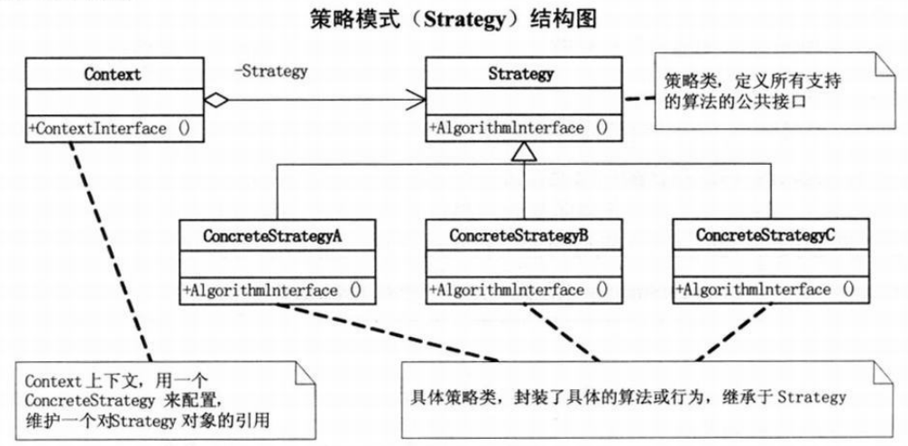

面向对象的封装、继承和多态三大特性是为了降低耦合性，从而实现程序的可维护（修改简单）、可复用、可扩展，并提高程序的灵活性。

#### 简单工厂模式 (Simple Factory)

在工厂类中创建实例对象，以多态的方式返回对象。工厂不一定要是一个单独的类，只是一种模式和思想。

#### 策略模式 (Strategy)

策略模式定义了算法族，可以随意进行使用算法的替换。只需要使用策略上下文来调用方法，选择需要使用的算法，实际用到的算法和抽象父类都不需要涉及到。该模式下可以结合简单工厂模式。

**策略模式是一种定义一系列算法的方法，从概念上来看，所有这些算法完成的都是相同的工作，只是实现不同，它可以以相同的方式调用所有的算法，减少了各种算法类与使用算法类之间的耦合。**

#### 装饰模式 (Decorator)

动态地给一个对象添加一些额外的职责，就增加功能来说，装饰模式比生成子类更为灵活。

#### 代理模式 (Proxy)

为其他对象提供一种代理以控制对这个对象的访问。

代理模式其实就在访问对象时引入一定程度的间接性，因为这种间接性，可以附加多种用途。

#### 工厂方法模式

定义一个用于创建对象的接口，让子类决定实例化哪一个类。工厂方法使一个类的实例化延迟到其子类。

工厂方法模式是对简单工厂的扩展，实现了开放-封闭原则，当需要扩展的时候，不需要再去修改工厂的内部代码，而是添加一个工厂的实现类来扩展现有的功能，通过子类工厂来替换父类（或接口）工厂。当需要某个对象时，只需要实例化对应的子类工厂即可，简化了对象创建的代码，提高扩展性。创建子类工厂的任务转移到了客户端，但是可以用反射的方法来实现最佳解决方案。

#### 原型模式 (Prototype)

用原型实例指定创建对象的种类，并且通过拷贝这些原型创建新的对象。原型模式其实就是从一个对象再创建另外一个可定制的对象，而且不需要知道任何创建的细节。

#### 模板方法模式 (Template Method)

定义一个操作中的算法的骨架，而将一些步骤延迟到子类中。模板方法使得子类可以不改变一个算法的结构即可重定义该算法的某些特定步骤。一般抽象类就是用来实现这种模板的父类。

模板方法模式提供了一个很好的代码复用平台，通过把不变的行为搬移到超类，去除子类中的重复代码来体现它的优势。

#### 外观模式

#### 单一职责原则(SRP)

就一个类而言，应该仅有一个引起它变化的原因。

#### 开放-封闭原则(OCP)

软件实体（类、模块、函数等等）应该可以扩展，但是不可修改。

#### 依赖倒转原则

高层模块不应该依赖低层模块，两个都应该依赖抽象；抽象不应该依赖细节，细节应该依赖抽象（面向接口编程）。

依赖倒转其实可以说是面向对象设计的标志，用哪种语言来编写程序不重要，如果编写时考虑的都是如何针对抽象编程而不是针对细节编程，即程序中所有的依赖关系都是终止于抽象类或者接口，那就是面向对象的设计，反之那就是过程化的设计了。

#### 里氏代换原则(LSP)

一个软件实体如果使用的是一个父类的话，那么一定使用于其子类，而且它察觉不出父类对象和子类对象的区别。也就是说，在软件里面，把父类都替换成它的子类，程序的行为没有变化。子类型必须能够替换掉它们的父类型。

这里体现了多态的应用。

#### 迪米特法则 (LoD 最少知识原则)

如果两个类不必彼此直接通信，那么这两个类就不应当发生直接的相互作用。如果其中一个类需要调用另一个类的某一个方法的话，可以通过第三者转发这个调用。也就是说，在类的结构设计上，每一个类都应当尽量降低成员的访问权限。根本思想是强调了类之间的松耦合，或者说信息的隐藏促进了软件的复用。